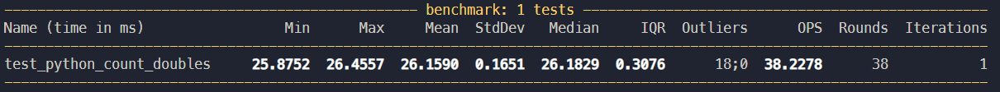
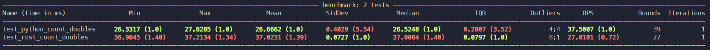
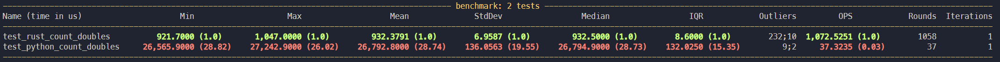
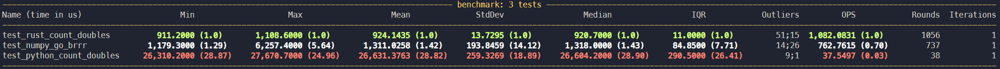
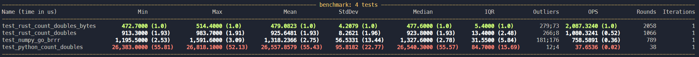

# rust 🦀 -> python 🐍 training wheels

You are a data scientist. You are staring down the barrel of an analysis which will be the envy of your company, if only the code to finish running before the heat death of the universe. You haven't profiled the reason why it's taking so long, but that doesn't stop you from believing that writing the code in a new language will be the solution. After all, the engineers keep saying 🐍 slow.

You recall a slack message where your VP of Engineering said "yeah python and rust have a great story. If we are trying to write lower level bindings for python we should look at Rust." You have otherwise never heard of Rust, you never seen C code, have no idea what garbage collection means, and don't know what a complier is. But the engineers keep saying 🐍 slow and 🦀 fast.

## Do Not Cheat

There will be a test. Follow the directions _exactly_ or you won't learn the lessons you need in order to pass the test. Write along, don't just copy and paste. If you copy/paste you are no better than Chat-GPT.

### I am a hack

Your search of desperation has led you here. I have seen the mighty crustacean in all it's glory - I have completed one whole tutorial of Rust/Python bindings. I'm largely copying [this tutorial](https://developers.redhat.com/blog/2017/11/16/speed-python-using-rust) (but it's old and they are real engineers so us data scientist can't understand them), and the docs for [maturin/PyO3](https://pyo3.rs/v0.19.2/). I'm making this for my reference and for your reference. As with all things, writing it down an digging in enough to explain it has led to deeper learning.

# Commence your ascension

Goal #1 is to replace a function in python with a function from a library that we will build in Rust. Goal #2 is to measure how much faster it is so you can post how smart you are all over your team's channels.

## python env

Hopefully by now you know how to use something like `venv`, `pyenv virtualenv`, `poetry`, etc. If you haven't, you probably want to figure that out. I'm going to use `venv`, which is to say that I'll be installing everything via `pip`. So get installing

```bash
python -m venv .env
source .env/bin/activate # or whatever you need to do for your OS
pip install pytest pytest-benchmark maturin
```

`maturin`, linked above, is the python-rust go between that we are going to be using here. It's slick, and it has way more features than we'll use here. Go read their docs and bask in their glory.

# Here's your terrible python code.

You are trying to count the number of pairs of characters that occur in a string. Why your code is taking so long to run is beyond me - maybe you are trying to run this on a string trillions upon trillions of characters long. Make a script called `doubles.py` and write the following code there:

```python
import string
import random

# use ZIP to find all instances of double letter pairs. You could use regex,
# or any number of better approaches. But you are a data scientist so this is
# the most likely way that the code is written.

def count_doubles(val: str)-> int:
    """
    wow such docstring

    Parameters
    ----------
    val: str

    Returns
    ----------
    int
        The number of letter pairs in val.
        i.e. val = 'abbcCddef' returns 2.
    """
    total = 0
    for c1, c2, in zip(val, val[1:]):
        if c1 == c2:
            total += 1
    return total
```

Your editor is now screaming about the unused imports for `string` and `random`. We're going to use those to generate some data to use for the benchmark. To satiate your editor, add:

```python
# benchmark data for 1M random letters
val = "".join(random.choice(string.ascii_letters) for i in range(1000000))
```

But both of those are from the standard library, and the sharp observers will recall that we imported pytest and pytest-benchmark. We're going to add some benchmarking via the `benchmark` fixture. Add this to the script:

```python
def test_python_count_doubles(benchmark):
    benchmark(count_doubles, val)
```

Now make sure this is working by running

```bash
pytest doubles.py
```


Congrats, you can now see how slow your code is.

# Get that Rust going

Download rust. https://www.rust-lang.org/tools/install. You have succeed in this if and only if `cargo` works on the command line.

## start the project

We are going to use `maturin` to help us manage Rust here. Start by running

```bash
maturin init
```

Select pyo3.

This should create a few files, notably `Cargo.toml`, `src`, and `pyproject.toml` (hope you weren't using poetry as your env manager lol). Welcome to the world of Rust. At this point, it would be wise to go [read a bit about what Rust is](https://www.rust-lang.org/learn), and about [`cargo`, it's package manager](https://doc.rust-lang.org/cargo/). But for the purposes of this tutorial, all you need to know is 🦀 go brrrrr.

`src/lib.rs` is where we will be writing Rust code. `Cargo.toml` defines the package. To note, in rust you don't have a choice of your env manager - you are using `cargo`, or some wrapper around it. Every language you try from here on out will have a better env management story than python, us 🐍s just have to take the L on that one.

## actually write some code

Into `src/lib.rs` we go. Start by deleting everything. Follow up strong with:

```rust
use pyo3::prelude::*;
```

You know this one, this is basically an import statement. Here you are telling Rust to bring in the `prelude` module from `pyo3` crate. `prelude` is a convention in Rust that has all the standard things you will need from a module or library. In python, we might have an `__init__.py`, you'd add imports for your module to that, and then tell python to import everything from a module which it does via that init. In python, we typically don't use `from module import *` because of namespace concerns. How do people typically do it in Rust? 🤷 . See "I'm a Hack" and ask a real dev.

edit: Yes, it looks like being more explicit in Rust is better too.

Oh yeah, you need to end every line with `;`. But having a end line character is a normal thing outside of python.

## actually actually write some code

For real now, let's add the equivalent function to what we had in python:

```rust
#[pyfunction]
fn count_doubles(_py: Python, val: &str) -> PyResult<u64> {
    let mut total: u64 = 0u64;
    for (c1, c2) in val.chars().zip(val.chars().skip(1)){
        if c1 == c2 {
            total += 1
        }
    }
    Ok(total)
}
```

Ok that's a real bit of code. I'd hope that it's not unreadable if you know python. Some parts might even look familiar. The first argument is a bit weird, but that's because we need to pass the python interpreter itself as an arg. Other notable features - actually needing to specify all your variable types. What a concept. If you want to know what else is going on:

1. Ask Chat-GPT
2. fact-check that lying SOB against the Rust documentation I linked above

Practically, you probably aren't solving this exact problem, so you need to go figure out what data types you need and the syntax for your algorithm. Again, see 1 and 2 there, you can get a long ways with that. Might be useful to include a real human in your learning loop too.

Last thing, we need to build the python module. Add the following:

```rust
#[pymodule]
fn string_doubles(_py: Python, m: &PyModule) -> PyResult<()> {
    m.add_function(wrap_pyfunction!(count_doubles, m)?)?;
    Ok(())
}
```

## compile the rust

We'll need to make some edits to `Cargo.toml`. Note that in the `pymodule` above, we called the module `string_doubles`. Change the `[package]` and `[lib]` fields in `Cargo.toml` to:

```toml
[package]
name = "string_doubles"
version = "0.1.0"
edition = "2021"

# See more keys and their definitions at https://doc.rust-lang.org/cargo/reference/manifest.html
[lib]
name = "string_doubles"
crate-type = ["cdylib"]

[dependencies]
pyo3 = "0.19.0"
```

Here you might notice that everything was nicely called `python-rust-how-to` before we deleted and changed all of it. `maturin` is smart like that, and it will pull the directory name to be the package name by default. Leverage that in the future, but for now you are smarter for having learned how to change it 🧠.

Now, the big moment where it all falls apart. It's important that you type the next command with confidence, otherwise the 🦀will smell your fear and complain about something or another not being configured properly.

🥁🥁🥁

```bash
maturin develop
```

This is where `maturin` is slick. Not only does this build the new crate, but it installs it in your python venv too.

## test the speed

Back in `doubles.py` (can you believe you still need to write in that pleb language?), import your new library

```python
import string_doubles
```

and add another benchmark for the new function

```python
def test_rust_count_doubles(benchmark):
    benchmark(string_doubles.count_doubles, val)
```

Now hit that `pytest doubles.py` once more



It's slower. All of that and it's slower. The engineers were wrong, 🐍FAST 🦀 SLOW.

That's it, thanks for reading, bye bye.

## Still here?

I lied - I said follow all the instructions and you would pass the test. Objectively though, we just failed the test. There was one instruction I omitted - that was because I learned this the hard way so it stuck with me. I have a feeling that if you are writing Rust to improve performance in your python code it is probably the single most important thing you should know.

From the [Rust performance book](https://nnethercote.github.io/perf-book/build-configuration.html):

```
The single most important build configuration choice is simple but easy to overlook: make sure you are using a release build rather than a dev build when you want high performance. This is usually done by specifying the --release flag to Cargo.
```

```bash
maturin develop --release
pytest doubles.py
```


It's just ~30x faster doing the exact same algorithm, simple as that. Lean back in your chair and take a deep breath - this is the developer high you came here for.

## find out that numpy was faster all along

Now snap back forward in your chair as you realize, "Wait, python already has a whole module for optimizing computations in C bindings." Numpy has a hilariously fast way of doing this computation. Ready?

```bash
pip install numpy
```

I'm not going to split out the cells, add this to your code but put the import at the top like a civilized person.

```python
import numpy as np

def doubles_numpy(val: str) -> int:
    ng = np.frombuffer(bytes(val, "UTF-8"), dtype=np.byte)
    return np.sum(ng[:-1] == ng[1:])


def test_numpy_go_brrr(benchmark):
    benchmark(doubles_numpy, val)
```


Is it faster speed wise? No, but only just. But would it have been faster to write rather than coming here and learning how to do it in Rust? well ...

Here's the thing, numpy is straight magic. There are some people that can easily reason though how to do arrayed operations, but I've never gotten there. Does it take more overhead to write the Rust implementation? Yes. But I might not be clever enough to write the numpy implementation at all. If you are, ⭐for you.

# Sleep easy, you are are basically a staff engineer now

Yep, you stretched right outside your comfort zone and ran through a single demo about another language. Congratulate yourself on a job well done. Remember, don't forget the second objective - slap that test result all over your team channels so everyone knows how great you are. Don't forget to take out the `numpy` result first, it's a much bigger flex without it. Bonus points if you use `python` recognizing emojis as valid characters to get a 🦀 in the function name.

# advanced topics

- None, for you are now an expert with true dominion over all programming.

## bytes instead of strings

You can use bytes instead of strings when doing the comparison, both in python and Rust. This is, to no one's surprise, faster. We have to use a slightly different algorithm too. Again, this was not me, it was [ripped directly from this blog post](https://developers.redhat.com/blog/2017/11/16/speed-python-using-rust). ex: in Rust:

```rust
#[pyfunction]
fn count_doubles_bytes(_py: Python, val: &str) -> PyResult<u64> {
    let mut total: u64 = 0u64;
    let mut chars = val.bytes();
    if let Some(mut c1) = chars.next() {
        for c2 in chars {
            if c1 == c2 {
                total += 1;
            }
            c1 = c2;
        }
    }
    Ok(total)
}

#[pymodule]
fn string_doubles(_py: Python, m: &PyModule) -> PyResult<()> {
    m.add_function(wrap_pyfunction!(count_doubles, m)?)?;
    m.add_function(wrap_pyfunction!(count_doubles_bytes, m)?)?;
    Ok(())
}
```


